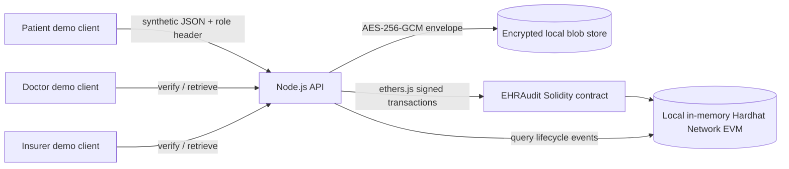

# System Architecture

## Component view

The API and local Hardhat test signers are trusted in this educational build. Role-header routes are disabled by default and require explicit demo opt-in; the CLI only binds to loopback. This remains a local safety boundary, not authentication: a real deployment would not treat a client-supplied role string as an identity proof.

The ordinary API accepts fabricated data. Only the benchmark's loopback server explicitly opts into the public, de-identified MIMIC-IV demo source marker; it generates random per-run aliases, uses a temporary encrypted store, and does not persist source files or row-level outputs. This narrow research path is not a general real-patient-data mode; see the [benchmark method](benchmark-method.md).

## Data placement

**On-chain:** record ID; patient wallet address; keyed pseudonymous patient ID; salted content commitment; encrypted-envelope hash; grantee and actor wallet addresses; consent expiry; transaction sender; event type; block/time metadata. Even these fields can reveal that a record exists and who interacted with it. Addresses and event timing are linkable, and ledger data cannot be deleted.

**Off-chain:** AES-256-GCM envelope containing the canonical synthetic payload and a random commitment salt. The demo writes one JSON envelope per record in a local file. The random IV and authentication tag are part of the envelope. The store is not a production data service.

**Never submitted:** clinical text, diagnosis code, provider, date, or patientRef value in plaintext to a contract call or event. A deterministic HMAC-based patient identifier prevents an observer without the application key from simply hashing guesses of the demo alias, but creates a stable linkable identifier. The same patient alias maps to the same pseudonym when the same key is used.

## Lifecycle

1. The patient demo role submits `synthetic: true`, a pseudonymous alias, and a small record payload.
2. The API validates the schema, derives a keyed patient pseudonym, generates a random 32-byte salt, canonicalizes `{ payload, commitmentSalt }`, computes its Keccak-256 content hash, and encrypts the bundle with AES-256-GCM under a purpose-specific key.
3. The encrypted envelope is saved locally. The patient signer creates a contract record containing the ID, pseudonym, plaintext commitment, and envelope hash.
4. The patient grants a doctor/insurer an expiry. The contract records the grant and emits an event.
5. A request checks that the actor is the patient or has an unexpired grant, compares the stored envelope hash with the contract commitment, authenticates/decrypts the envelope, and recomputes the salted content hash. Only then does this API ask the contract to emit `AccessReported`. A direct contract caller with access can also emit that event without inspecting the blob; it is a caller assertion, not proof of retrieval or integrity.
6. The patient revokes access. Later requests fail the contract-backed consent check. Previously copied or cached plaintext cannot be recalled.
7. The audit endpoint queries contract events by record ID and returns the lifecycle history.

## Prototype contract interface

- `createRecord(recordId, patientId, dataHash, encryptedBlobHash)` binds commitments to the patient signer.
- `grantAccess(recordId, grantee, expiresAt)` is patient-only and validates future expiry.
- `revokeAccess(recordId, grantee)` is patient-only.
- `hasAccess(recordId, actor)` checks patient ownership or an unexpired grant.
- `reportAccess(recordId)` emits `AccessReported` when the caller has access; it cannot verify off-chain blob retrieval or integrity.
- `getRecord` returns metadata and hashes, never the record payload.

## API surface

| Route | Required demo identity | Purpose |
|---|---|---|
| `GET /health` | None | Liveness and mode marker |
| `GET /api/demo/accounts` | None | Show local demonstration addresses |
| `POST /api/records` | `patient` | Create encrypted synthetic record |
| `POST /api/records/:id/consent` | `patient` | Grant doctor/insurer with expiry |
| `POST /api/records/:id/revoke/:grantee` | `patient` | Revoke a grant |
| `GET /api/records/:id/verify` | Patient or active grantee | Verify hashes without returning the record |
| `GET /api/records/:id/access` | Patient or active grantee | Verify and return decrypted payload |
| `GET /api/records/:id/audit` | Any demo role header | Read public contract events for the record; metadata remains linkable |

## Operational model

Each server process creates a new, single-node Hardhat Network chain and deploys the contract. This is an educational local EVM rather than a durable private consortium network. The CLI requires a 32-byte random hexadecimal `EHR_MASTER_KEY`, explicit `EHR_ENABLE_DEMO_AUTH=true`, and loopback binding. The default local ciphertext directory is temporary and removed at shutdown. Setting `EHR_STORE_DIR` allows ciphertext inspection, but ledger state still disappears at shutdown. No data migration/recovery behavior is implemented.
